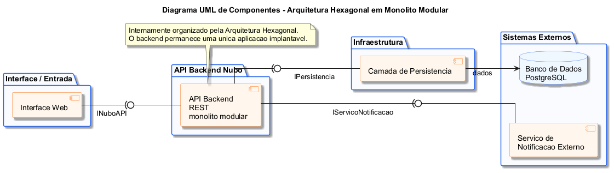
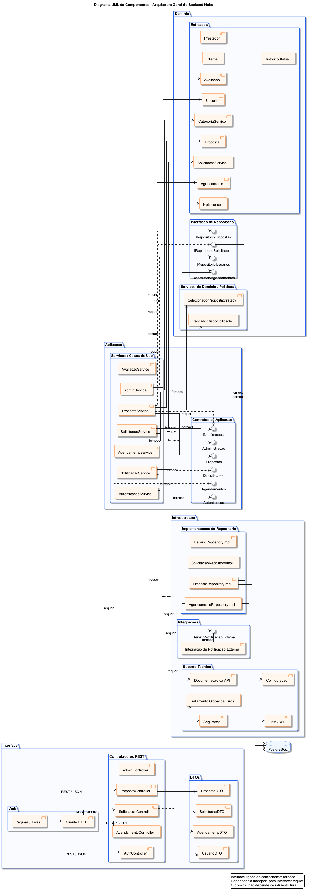
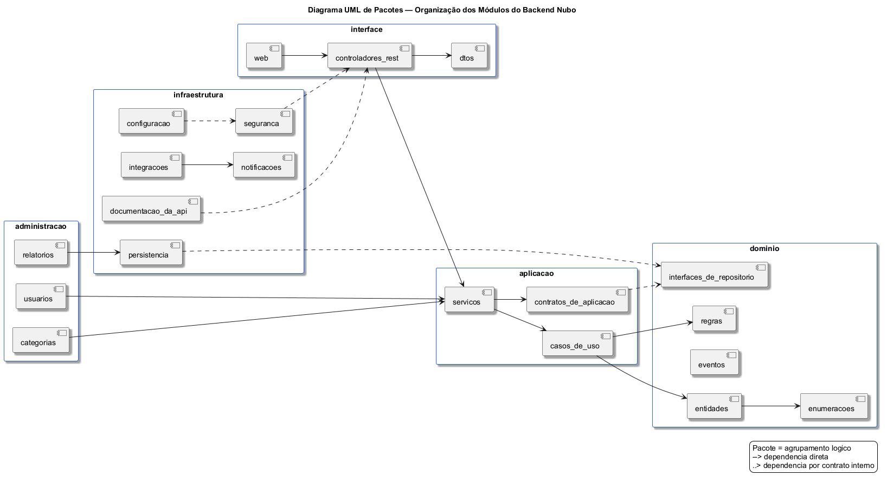
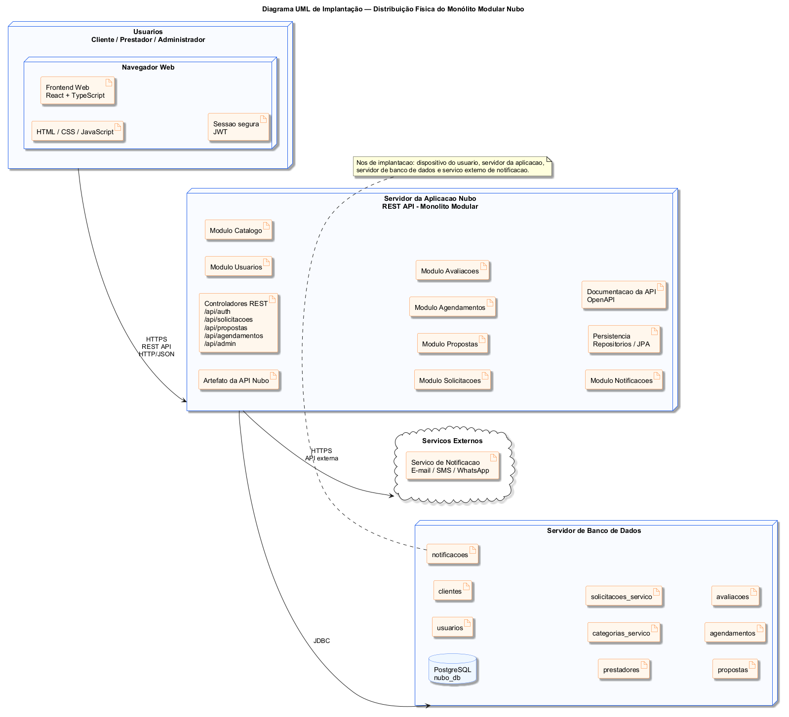
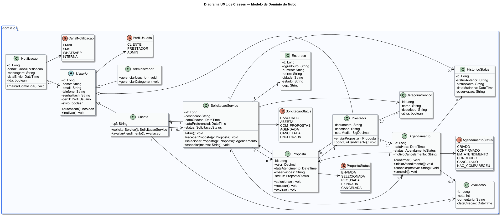
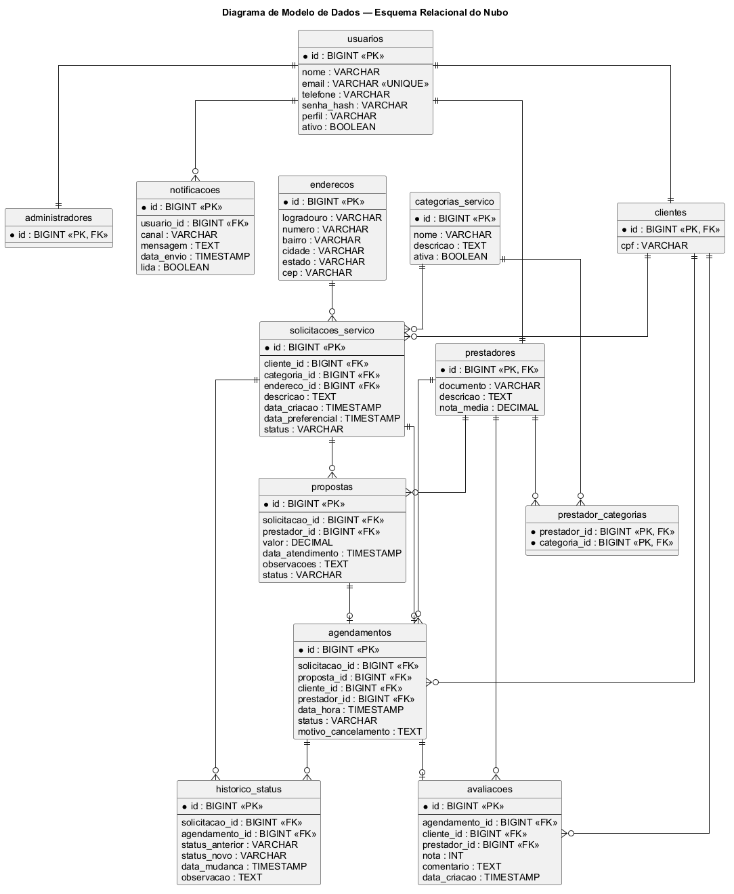

<!-- README estruturado a partir do template da disciplina, preenchido com informações fictícias/projetadas para a aplicação Nubo. -->

---

# 🗓️ Nubo — Plataforma de Agendamento e Gestão de Serviços Locais

> [!NOTE]
> O Nubo é uma plataforma web projetada para conectar clientes a prestadores de serviços locais, centralizando solicitações, propostas, agendamentos, notificações, avaliações e histórico de status em um fluxo rastreável.

<table>
  <tr>
    <td width="800px">
      <div align="justify">
        O <b>Nubo</b> foi projetado como uma aplicação web para organizar a contratação de serviços locais. A proposta é reduzir a dependência de conversas informais, permitir comparação de propostas, registrar estados importantes do atendimento e oferecer uma base clara para evolução futura do produto. Este repositório reúne a documentação de projeto, a especificação de requisitos, os diagramas PlantUML e os artefatos de apoio utilizados no Trabalho 2 da disciplina Projeto de Software.
      </div>
    </td>
    <td>
      <div align="center">
        <h1>☁️</h1>
        <strong>Nubo</strong><br/>
        <sub>Serviços locais</sub>
      </div>
    </td>
  </tr>
</table>

---

## 🚧 Status do Projeto


O projeto está em fase de **modelagem e documentação de software**. As tecnologias listadas representam uma proposta técnica fictícia para uma implementação futura da aplicação.

---

## 📚 Índice

- [Links Úteis](#-links-úteis)
- [Sobre o Projeto](#-sobre-o-projeto)
- [Funcionalidades Principais](#-funcionalidades-principais)
- [Tecnologias Utilizadas](#-tecnologias-utilizadas)
- [Arquitetura](#-arquitetura)
  - [Diagramas principais](#diagramas-principais)
  - [Fontes PlantUML](#fontes-plantuml)
- [Instalação e Execução](#-instalação-e-execução)
  - [Pré-requisitos](#pré-requisitos)
  - [Variáveis de Ambiente](#-variáveis-de-ambiente)
  - [Instalação de Dependências](#-instalação-de-dependências)
  - [Inicialização do Banco de Dados PostgreSQL](#-inicialização-do-banco-de-dados-postgresql)
  - [Como Executar a Aplicação](#-como-executar-a-aplicação)
- [Deploy](#-deploy)
- [Estrutura de Pastas](#-estrutura-de-pastas)
- [Demonstração](#-demonstração)
- [Testes](#-testes)
- [Documentações utilizadas](#-documentações-utilizadas)
- [Autores](#-autores)
- [Contribuição](#-contribuição)
- [Agradecimentos](#-agradecimentos)
- [Licença](#-licença)

---

## 🔗 Links Úteis

- 📄 **Documentação de Projeto:** [docs/documentacao-projeto.md](./docs/documentacao-projeto.md)
- 📄 **Documentação de Projeto em PDF:** [docs/documentacao-projeto.pdf](./docs/documentacao-projeto.pdf)
- 📘 **Especificação de Requisitos:** [docs/especificacao-requisitos.md](./docs/especificacao-requisitos.md)
- 📘 **Especificação de Requisitos em PDF:** [docs/especificacao-requisitos.pdf](./docs/especificacao-requisitos.pdf)
- 📑 **Contratos de Operação:** [docs/contratos-operacao.md](./docs/contratos-operacao.md)
- 🧩 **Fontes PlantUML:** [codigos/](./codigos)
- 🖼️ **Diagramas Renderizados:** [imagens/](./imagens)
- 🛠️ **Ferramentas PlantUML:** [tools/](./tools)

---

## 📝 Sobre o Projeto

O Nubo existe para organizar o fluxo de contratação de serviços locais. Em cenários comuns, clientes e prestadores negociam por mensagens soltas, sem padronização de propostas, histórico de status, confirmação estruturada de agenda ou registro de conclusão. Isso dificulta a comparação entre prestadores, o acompanhamento do atendimento e a rastreabilidade das decisões tomadas durante o processo.

A aplicação proposta centraliza esse fluxo em uma plataforma web. O cliente registra uma solicitação de serviço, os prestadores compatíveis enviam propostas, o cliente escolhe uma proposta e o sistema gera um agendamento. Depois disso, o atendimento pode ser acompanhado, concluído, avaliado e registrado no histórico.

O projeto foi construído no contexto da disciplina **Projeto de Software**, com foco em documentação, requisitos, arquitetura e modelagem. Mesmo assim, a solução foi pensada como um produto realista, capaz de evoluir para uma plataforma funcional de marketplace de serviços locais.

---

## ✨ Funcionalidades Principais

- 🔐 **Cadastro e autenticação:** criação de contas para clientes, prestadores e administradores.
- 🧾 **Solicitação de serviço:** registro de categoria, endereço, descrição e datas preferenciais.
- 🔎 **Consulta de solicitações:** prestadores visualizam demandas compatíveis com suas categorias.
- 💬 **Envio de propostas:** prestadores informam valor estimado, data, horário e observações.
- ✅ **Seleção de proposta:** clientes comparam propostas e escolhem uma opção.
- 📅 **Agendamento:** criação de agenda a partir da proposta selecionada.
- 🚫 **Cancelamento:** clientes ou prestadores podem cancelar atendimentos conforme o estado atual.
- 🏁 **Conclusão de atendimento:** prestadores registram a finalização do serviço.
- ⭐ **Avaliação:** clientes avaliam atendimentos concluídos.
- 🔔 **Notificações:** comunicação dos principais eventos do fluxo.
- 🧭 **Histórico de status:** rastreamento das mudanças relevantes de solicitação e agendamento.
- 🛡️ **Administração:** acompanhamento de usuários, categorias, solicitações e prestadores.

---

## 🛠 Tecnologias Utilizadas

As tecnologias abaixo representam a **proposta técnica fictícia** para a aplicação Nubo. Este repositório prioriza a documentação e os modelos de projeto.

### 💻 Front-end

- **Framework/Biblioteca:** React
- **Linguagem/Superset:** TypeScript
- **Build Tool:** Vite
- **Estilização:** Tailwind CSS
- **Roteamento:** React Router
- **Cliente HTTP:** Axios

### 🖥️ Back-end

- **Linguagem/Runtime:** Java 17
- **Framework:** Spring Boot
- **API:** Spring Web / REST
- **Segurança:** Spring Security com JWT
- **Persistência:** Spring Data JPA
- **ORM:** Hibernate
- **Documentação da API:** OpenAPI / Swagger

### 🗄️ Banco de Dados

- **Banco relacional:** PostgreSQL
- **Migrações:** Flyway
- **Estratégia:** modelo relacional com mapeamento objeto-relacional

### ⚙️ Infraestrutura & DevOps

- **Ambiente local planejado:** Docker e Docker Compose
- **Hospedagem front-end planejada:** Vercel
- **Hospedagem back-end planejada:** Render ou Railway
- **Banco gerenciado planejado:** PostgreSQL gerenciado
- **CI/CD planejado:** GitHub Actions

### 📘 Documentação e Modelagem

- **Diagramas:** PlantUML
- **Documentação textual:** Markdown
- **Entrega formal:** PDF
- **Ferramentas de apoio:** `plantuml.jar` e API PlantUML disponibilizada em `tools/`

---

## 🏗 Arquitetura

O Nubo adota uma arquitetura cliente-servidor com comunicação via API REST. O backend é modelado como um **monólito modular**, ou seja, uma única aplicação implantável organizada em módulos internos, como autenticação, solicitações, propostas, agendamentos, notificações e administração.

Internamente, o backend segue a **Arquitetura Hexagonal**, separando responsabilidades em interface, aplicação, domínio e infraestrutura. Essa organização mantém as regras de negócio protegidas de detalhes técnicos, como banco de dados, autenticação, documentação da API e integração com serviços externos de notificação.

A arquitetura foi escolhida considerando a evolução esperada do produto. Os fluxos de solicitação, proposta, seleção, agendamento, cancelamento, conclusão e avaliação tendem a crescer em regras e integrações. Ao isolar o domínio, o sistema pode trocar mecanismos de persistência, adicionar novos canais de entrada e substituir integrações externas sem comprometer o núcleo das regras de negócio.

### Diagramas principais

| Visão Arquitetural | Componentes do Backend |
| :---: | :---: |
|  |  |
| Pacotes do Backend | Implantação |
|  |  |
| Classes de Domínio | Modelo de Dados |
|  |  |

### Fontes PlantUML

- [Diagrama de Caso de Uso](./codigos/diagrama-de-caso-de-uso.puml)
- [Diagrama de Arquitetura](./codigos/diagrama-de-arquitetura.puml)
- [Diagrama de Pacotes](./codigos/diagrama-de-pacotes.puml)
- [Diagrama de Componentes](./codigos/diagrama-de-componentes.puml)
- [Diagrama de Implantação](./codigos/diagrama-de-implantacao.puml)
- [Diagrama de Classes](./codigos/diagrama-de-classes.puml)
- [Diagrama de Modelo de Dados](./codigos/diagrama-de-modelo-dados.puml)
- [Diagramas de Sequência](./codigos)
- [Diagramas de Comunicação](./codigos)
- [Diagramas de Estados](./codigos)

Diagramas comportamentais complementares:

- [SSD UC10 - Cancelar Agendamento](./codigos/diagrama-de-sequencia-sistema-cancelar-agendamento.puml)
- [SSD UC11 - Concluir Atendimento](./codigos/diagrama-de-sequencia-sistema-concluir-atendimento.puml)
- [SSD - Fluxo Completo de Contratação](./codigos/diagrama-de-sequencia-sistema-fluxo-completo-contratacao.puml)
- [Sequência de Projeto - Enviar Proposta](./codigos/diagrama-de-sequencia-projeto-enviar-proposta.puml)
- [Sequência de Projeto - Cancelar Agendamento](./codigos/diagrama-de-sequencia-projeto-cancelar-agendamento.puml)
- [Comunicação - Enviar Proposta](./codigos/diagrama-de-comunicacao-enviar-proposta.puml)
- [Estados - Proposta](./codigos/diagrama-de-estados-proposta.puml)

---

## 🔧 Instalação e Execução

> [!IMPORTANT]
> Este repositório contém a documentação e os modelos do projeto. Os comandos abaixo representam uma proposta de execução para uma implementação futura da aplicação.

### Pré-requisitos

- Java JDK 17 ou superior
- Node.js LTS 18 ou superior
- npm ou yarn
- Docker e Docker Compose
- PostgreSQL 16 ou superior
- PlantUML, ou `tools/plantuml.jar`

### 🔑 Variáveis de Ambiente

#### 1. Back-end Spring Boot

| Variável | Descrição | Exemplo |
| :--- | :--- | :--- |
| `SERVER_PORT` | Porta da API. | `8080` |
| `SPRING_DATASOURCE_URL` | URL JDBC do PostgreSQL. | `jdbc:postgresql://localhost:5432/nubo` |
| `SPRING_DATASOURCE_USERNAME` | Usuário do banco. | `postgres` |
| `SPRING_DATASOURCE_PASSWORD` | Senha do banco. | `senha-segura` |
| `JWT_SECRET` | Chave para assinatura dos tokens. | `chave-local-de-desenvolvimento` |
| `NOTIFICATION_API_URL` | URL do serviço externo de notificação. | `https://api.notificacao.local` |

#### 2. Front-end React/Vite

| Variável | Descrição | Exemplo |
| :--- | :--- | :--- |
| `VITE_API_URL` | URL base da API. | `http://localhost:8080/api` |
| `VITE_APP_NAME` | Nome público da aplicação. | `Nubo` |

### 📦 Instalação de Dependências

Estrutura planejada para uma implementação futura:

```bash
# Front-end
cd frontend
npm install

# Back-end
cd ../backend
./mvnw clean install
```

### 💾 Inicialização do Banco de Dados PostgreSQL

```bash
docker run --name nubo-postgres \
  -e POSTGRES_USER=postgres \
  -e POSTGRES_PASSWORD=senha-segura \
  -e POSTGRES_DB=nubo \
  -p 5432:5432 \
  -d postgres:16
```

### ⚡ Como Executar a Aplicação

```bash
# Terminal 1 - Back-end
cd backend
./mvnw spring-boot:run

# Terminal 2 - Front-end
cd frontend
npm run dev
```

### 🧩 Renderização dos Diagramas PlantUML

```bash
java -Djava.awt.headless=true -jar tools/plantuml.jar -charset UTF-8 -tpng -o ../imagens codigos/*.puml
```

---

## 🚀 Deploy

O deploy planejado para uma implementação futura considera:

1. **Front-end:** publicação dos arquivos estáticos React/Vite na Vercel.
2. **Back-end:** execução da API Spring Boot em Render.
3. **Banco de Dados:** PostgreSQL gerenciado.
4. **Notificações:** integração com serviço externo dedicado.
5. **CI/CD:** GitHub Actions para validação, testes, build e publicação.

Variáveis esperadas em produção:

```txt
VITE_API_URL=https://api.nubo.example.com
SPRING_DATASOURCE_URL=jdbc:postgresql://host:5432/nubo
SPRING_DATASOURCE_USERNAME=nubo_admin
SPRING_DATASOURCE_PASSWORD=<valor-seguro>
JWT_SECRET=<valor-seguro>
NOTIFICATION_API_URL=https://notificacoes.example.com
```

---

## 📂 Estrutura de Pastas

Estrutura atual da entrega documental:

```txt
nubo-scheduling-system/
├── README.md
├── LICENSE
├── codigos/
│   └── *.puml
├── imagens/
│   └── *.png
├── docs/
│   ├── documentacao-projeto.md
│   ├── documentacao-projeto.pdf
│   ├── especificacao-requisitos.md
│   ├── especificacao-requisitos.pdf
│   └── contratos-operacao.md
└── tools/
    ├── plantuml.jar
    └── Projeto PlantUML API/
```

---

## 🎥 Demonstração

Como a implementação funcional não faz parte desta entrega, a demonstração ocorre por meio dos modelos e documentos do projeto.

| Artefato | Descrição |
| :--- | :--- |
| [Documentação de Projeto](./docs/documentacao-projeto.md) | Consolida modelos de usuário, requisitos, contratos, arquitetura, diagramas e modelo de dados. |
| [Especificação de Requisitos](./docs/especificacao-requisitos.md) | Descreve problema, domínio, visão de domínio, requisitos funcionais, requisitos não funcionais e regras de negócio. |
| [Diagramas Renderizados](./imagens) | Contém as imagens PNG geradas a partir dos arquivos PlantUML. |
| [Fontes PlantUML](./codigos) | Contém os modelos editáveis dos diagramas. |

Fluxos demonstrados nos diagramas:

- Solicitar serviço.
- Enviar proposta.
- Selecionar proposta.
- Gerar agendamento.
- Cancelar atendimento.
- Concluir atendimento.
- Avaliar serviço.

---

## 🧪 Testes

Não há testes automatizados executáveis nesta entrega, pois o repositório é documental. Para uma implementação futura, estão previstos:

- testes unitários das regras de domínio;
- testes dos serviços de aplicação;
- testes de integração da API REST;
- testes de repositórios com PostgreSQL;
- testes ponta a ponta dos fluxos principais.

---

## 🔗 Documentações utilizadas

- [Documentação de Projeto](./docs/documentacao-projeto.md)
- [Especificação de Requisitos](./docs/especificacao-requisitos.md)
- [Contratos de Operação](./docs/contratos-operacao.md)
- [Documentação oficial do PlantUML](https://plantuml.com/)
- [Documentação oficial do Spring Boot](https://spring.io/projects/spring-boot)
- [Documentação oficial do React](https://react.dev/)
- [Documentação oficial do PostgreSQL](https://www.postgresql.org/docs/)

---

## 👥 Autores

| 👤 Nome | GitHub | E-mail |
|---|---|---|
| Pedro Henrique Silva Vargas | PHnsilva | phnsilva1@gmail.com |

---

## 🤝 Contribuição

Contribuições futuras devem preservar o foco documental e a consistência dos modelos.

1. Faça um fork do projeto.
2. Crie uma branch para sua alteração: `git checkout -b docs/minha-alteracao`.
3. Edite os arquivos Markdown ou PlantUML necessários.
4. Renderize novamente os diagramas alterados.
5. Faça commit usando Conventional Commits.
6. Abra um Pull Request descrevendo a mudança.

---

## 🙏 Agradecimentos

Agradeço à **PUC Minas** e à disciplina **Projeto de Software** pelo direcionamento acadêmico para elaboração dos modelos de domínio, requisitos, arquitetura e projeto do sistema.

---

## 📄 Licença

Este projeto é distribuído conforme os termos descritos no arquivo [LICENSE](./LICENSE).

---
